# 📘 CDB Portal V2 (SMT Customer Portal) — Visual Illustrated Guide Book

> **System Name:** CDB Portal / SMT Customer Portal  
> **Client / Organization:** Arshi Enterprises  
> **Application Type:** Device Lifecycle, GPS Fleet Activation, Due Tracking & GST Billing ERP  
> **Production Domain:** [cdbportal.cloud](https://cdbportal.cloud)  
> **Production Server:** Ubuntu 24.04 VPS (`187.127.185.4`)

---

## 📑 Table of Contents
1. [Project Overview & Objectives](#1-project-overview--objectives)
2. [Technology Stack & System Architecture](#2-technology-stack--system-architecture)
3. [User Roles & Security Boundaries](#3-user-roles--security-boundaries)
4. [Illustrated Module Workflows (With Screenshots)](#4-illustrated-module-workflows)
   - [4.1 Executive Dashboard](#41-executive-dashboard)
   - [4.2 Device Inventory & Add Device](#42-device-inventory--add-device)
   - [4.3 Service Requests: Device Activation (Single & Bulk)](#43-service-requests-device-activation)
   - [4.4 Renewal Due Devices & Extensions](#44-renewal-due-devices--extensions)
   - [4.5 Invoice & Dealer Bill Generator](#45-invoice--dealer-bill-generator)
   - [4.6 Due Dashboard & Payment Tracking](#46-due-dashboard--payment-tracking)
   - [4.7 Ledger Book & Transaction Audit](#47-ledger-book--transaction-audit)
   - [4.8 User & Hierarchy Management](#48-user--hierarchy-management)
   - [4.9 Automated Backups & Disaster Recovery](#49-automated-backups--disaster-recovery)
5. [Production Server Architecture & VPS Cheatsheet](#5-production-server-architecture--vps-cheatsheet)
6. [Troubleshooting & Maintenance FAQ](#6-troubleshooting--maintenance-faq)

---

## 1. Project Overview & Objectives

**CDB Portal V2** is an enterprise GPS device distribution and subscription billing platform developed for **Arshi Enterprises**. It automates device inventory lifecycle, bulk service activations, subscription validity calculations, dealer dues tracking, and GST-compliant invoicing.

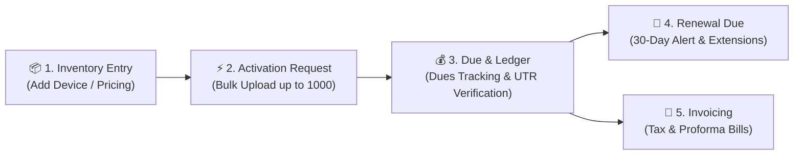

---

## 2. Technology Stack & System Architecture

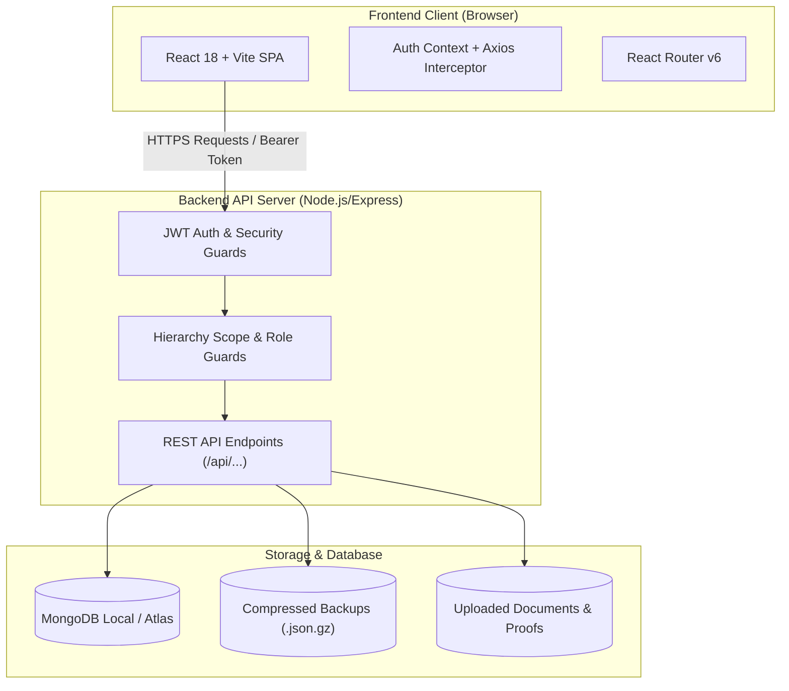

- **Frontend:** React 18, Vite 5, React Icons (`Fa...`), React Router DOM, Axios, Custom Responsive CSS.
- **Backend:** Node.js (v20+), Express.js, Mongoose ODM, JWT, Multer, Gzip/Zlib compression.
- **Database:** MongoDB (`mongodb://127.0.0.1:27017/smt_portal` on production VPS).
- **Process Manager:** PM2 (`smt-portal-backend`).
- **Web Server:** Nginx (Reverse proxy with SSL on port 80/443).

---

## 3. User Roles & Security Boundaries

| Role | System Role / UserType | Scope & Access Rights |
| :--- | :--- | :--- |
| **👑 Admin** | `partner` / `Administration` | Full access across all dealers, devices, bills, dues, backups, and user management. |
| **🏢 Dealer** | `customer` / `Dealer` | View assigned inventory, raise single/bulk activation requests, manage assigned sub-dealers, view own dues & bills. |
| **🏪 Sub-Dealer** | `customer` / `Sub Dealer` | Operates strictly under their parent Dealer. Can view and raise requests for devices assigned to them. |

---

## 4. Illustrated Module Workflows

---

### 4.1 Executive Dashboard
The **Dashboard** gives instant financial, inventory, and subscription visibility.

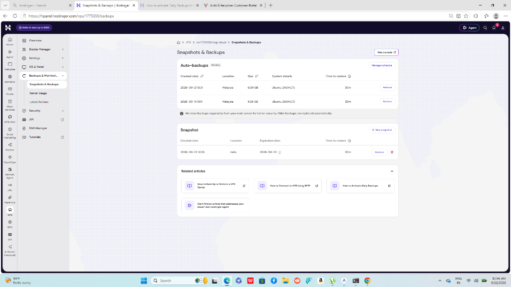

#### Key Highlights:
- **Total Devices & Status Breakdown:** Real-time count of Active, Inactive, and Expired devices.
- **Financial Summary Cards:** Total Billed Amount, Total Collected Amount, and Total Outstanding Dues.
- **Quick Links:** Direct shortcuts to Activation Requests, Due Dashboard, and Add Device.

---

### 4.2 Device Inventory & Add Device
Register new devices into the warehouse with dynamic pricing and validity configuration.

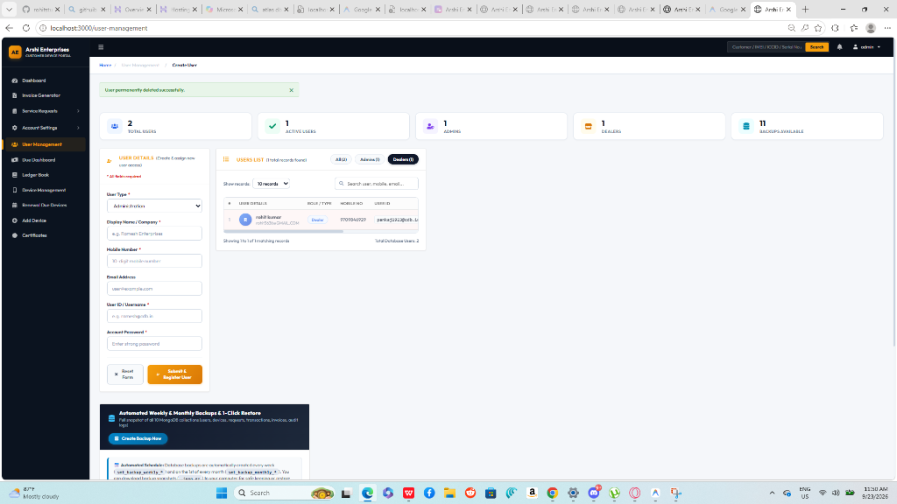

#### Fields & Features:
- **Device Identifiers:** IMEI (15 digits), ICCID (19-20 digits), Serial Number, and Model.
- **Default Pricing Configuration:** Set 1-Year Rate (₹) and 2-Year Rate (₹) directly during entry.
- **Initial Validity:** Configurable validity period (1 Year / 2 Year).
- **Dealer Assignment:** Devices can be assigned immediately or kept in unassigned central stock.

---

### 4.3 Service Requests: Device Activation
Dealers submit activation requests for installed devices. Supports both individual submission and high-volume batch imports.

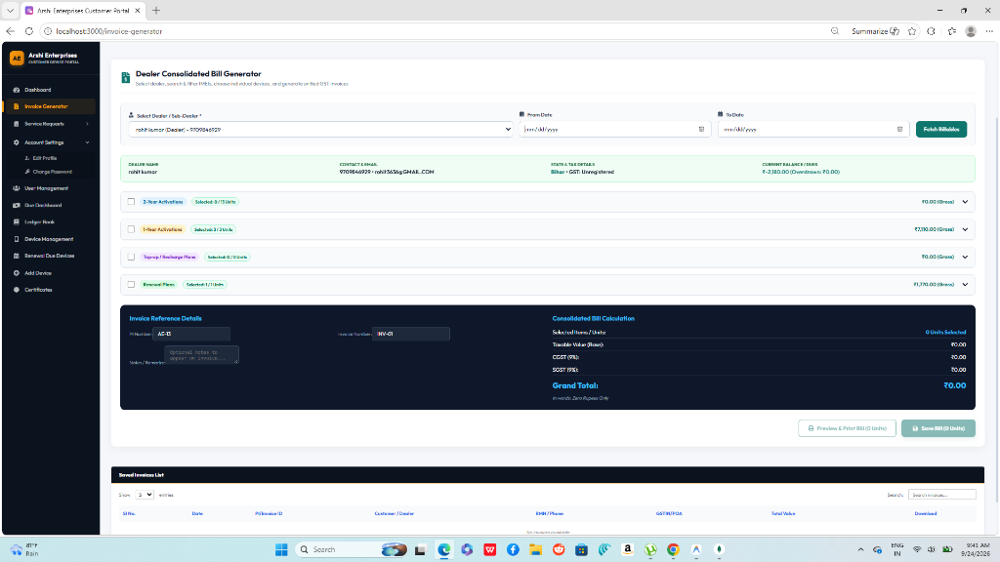

#### Workflow:
1. **Bulk Upload Support:** Upload Excel/CSV with up to **1,000 devices** in a single batch.
2. **Auto-Validation:** The system validates that IMEIs exist in inventory and are not duplicate-activated.
3. **Admin Review & Approval:**
   - **Approve:** Activates device, calculates expiration date, updates dealer dues, and logs transaction.
   - **Reject:** Returns device to unactivated state with reason noted.

---

### 4.4 Renewal Due Devices & Extensions
Monitors devices nearing subscription expiration and streamlines extension requests.

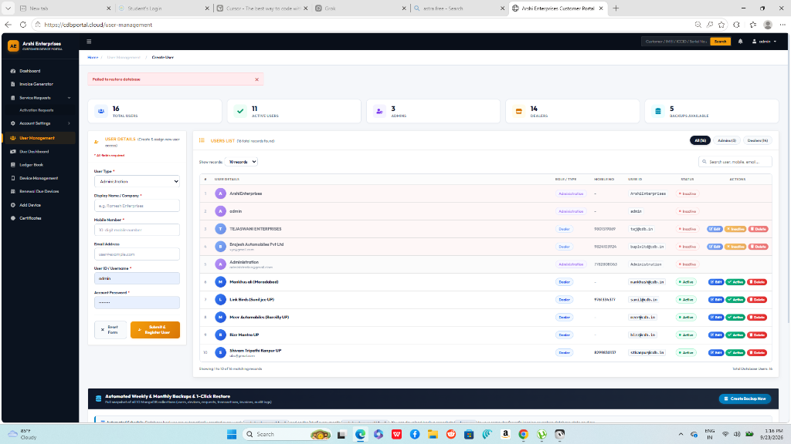

#### Workflow:
- **30-Day Alert Window:** Automatically highlights devices expiring in ≤ 30 days or already expired.
- **Extension Plans:** 1-Year or 2-Year renewal extensions.
- **Custom Renewal Amount:** Editable renewal fee field allowing negotiated rates before approval.

---

### 4.5 Invoice & Dealer Bill Generator
Automates professional tax invoicing and proforma billing with state-wise GST logic.

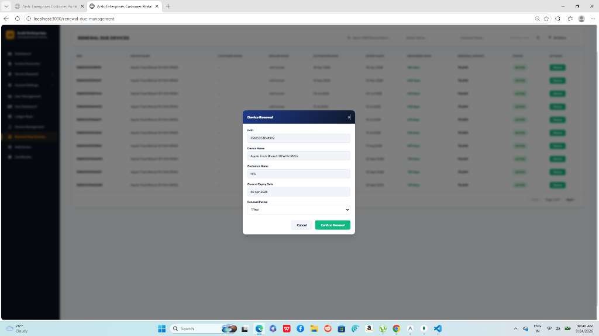

#### GST Intelligence & Billing Types:
- **Tax Invoice (INV):** Official GST invoice with sequential invoice numbering for tax filing.
- **Dealer Proforma Bill:** Operational statement for dealer settlements.
- **Tax Calculations:**
  - **Intra-State (`Bihar` to `Bihar`):** 9% CGST + 9% SGST.
  - **Inter-State (Outside `Bihar`):** 18% IGST.
- **A4 Print Engine:** Formatted with bank details, UPI QR code, company PAN/GSTIN, and authorized signatory.

---

### 4.6 Due Dashboard & Payment Tracking
Complete financial control center tracking outstanding balances across all dealers.

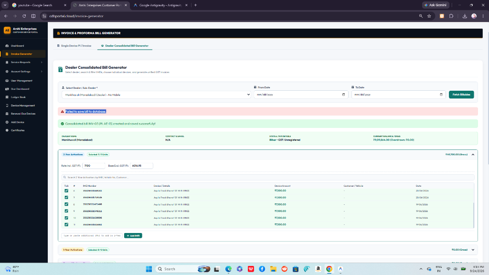

#### Financial Accounting Formula:
$$\text{Current Dealer Dues} = \sum (\text{Active Device Charges} + \text{Invoiced Amounts}) - \sum (\text{Verified Payments})$$

#### Payment Verification Flow:
1. Dealer transfers payment via NEFT / RTGS / UPI and submits UTR number + bank payment screenshot.
2. Request appears in **Payment Verification Requests** queue.
3. Admin verifies bank credit and approves: Dues are reduced instantly in real-time.

---

### 4.7 Ledger Book & Transaction Audit
A double-entry style financial transaction history providing auditability for every rupee.

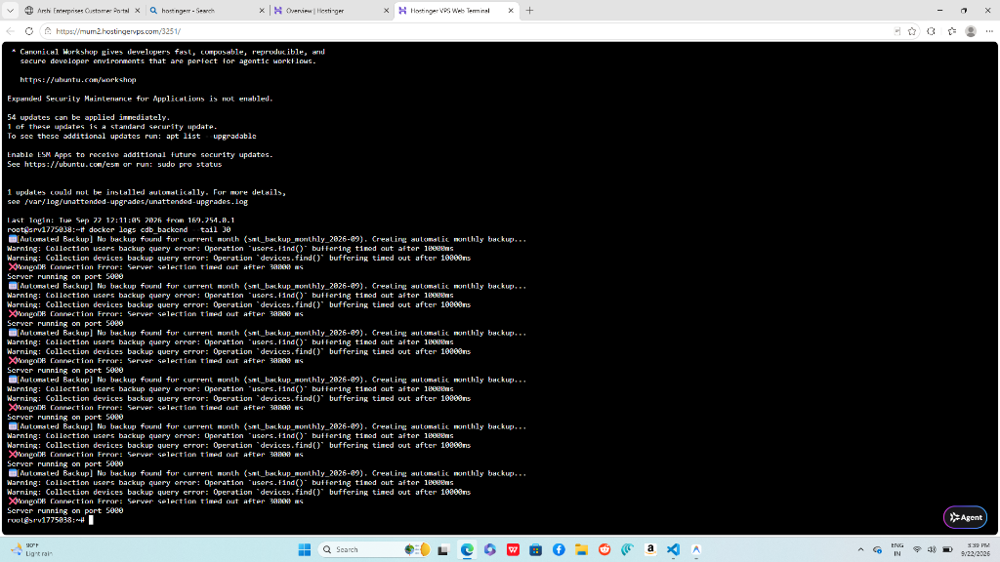

#### Tracked Events:
- Device activations (Debit entry against dealer account).
- Renewal approvals (Debit entry).
- Payment receipts & settlements (Credit entry).
- Date, Transaction ID, Reference IMEI, Description, and Running Balance.

---

### 4.8 User & Hierarchy Management
Administers portal credentials, company details, and role assignments.

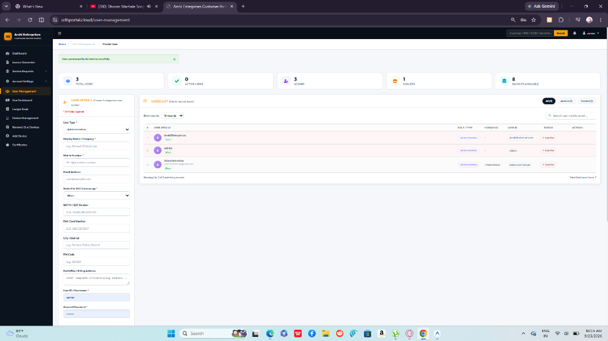

#### Core Operations:
- **Add / Edit User:** Set Display Name, Mobile, Email, State, GSTIN, PAN, City, and Full Billing Address.
- **Status Toggle:** Click the **Active / Inactive** button to instantly grant or suspend portal access.
- **Delete Account:** Safely remove duplicate or obsolete accounts.
  - *Safety Guard:* Logged-in admin cannot delete themselves, and the last admin account is protected.

---

### 4.9 Automated Backups & Disaster Recovery
Complete data protection suite with automated snapshots and one-click restore.

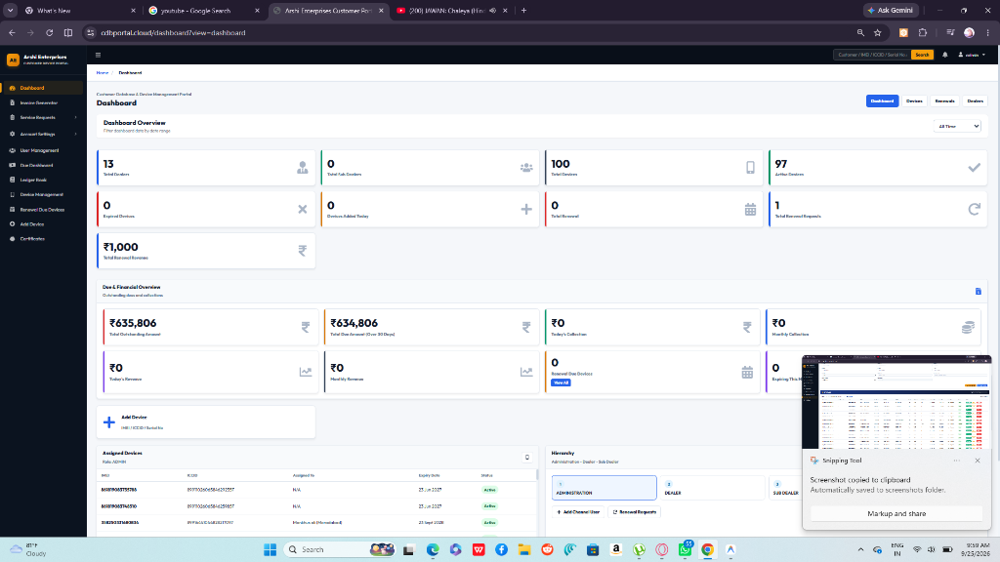

#### Features:
- **Create Backup Now:** Generates compressed `.json.gz` database snapshots on demand.
- **Download:** Download any snapshot directly to local storage.
- **Restore with 1-Time Safety Undo:**
  - Before restoring an old snapshot, the system creates an automated pre-restore safety checkpoint.
  - If a restore was done accidentally, click **"1-Time Undo"** to immediately revert.
- **Delete Backup:** Permanently remove old backups from disk.

---

## 5. Production Server Architecture & VPS Cheatsheet

### Directory Layout on VPS (`187.127.185.4`):
```
/var/www/smt-portal/
├── backend/
│   ├── config/             # DB connection & environment
│   ├── middleware/         # Auth, hierarchy scoping, security
│   ├── models/             # Mongoose schemas (User, Device, Invoice, etc.)
│   ├── routes/             # API routes
│   ├── storage/backups/    # Gzipped database snapshots (.json.gz)
│   ├── uploads/            # Payment receipts & documents
│   ├── server.js           # Express app entry point
│   ├── clear_portal_data.js# Operational reset utility
│   └── .env                # Production config (DB URI, JWT secret)
├── frontend/
│   ├── src/                # React source code
│   ├── dist/               # Built static bundle served by Nginx
│   └── package.json
└── docker-compose.yml       # Docker deployment descriptor
```

### Essential VPS Commands:

```bash
# 1. Connect to VPS
ssh root@187.127.185.4
cd /var/www/smt-portal

# 2. Deploy latest code from GitHub
git pull origin main

# 3. Build frontend bundle
cd frontend && npm run build

# 4. Restart backend server
cd ../backend && pm2 restart all

# 5. Inspect backend live logs
pm2 logs smt-portal-backend --lines 50

# 6. Reset operational test data (Keeps all User & Dealer logins safe)
cd /var/www/smt-portal/backend
node clear_portal_data.js "mongodb://127.0.0.1:27017/smt_portal"
```

---

## 6. Troubleshooting & Maintenance FAQ

### Q1: Dealer dues or device count does not match on dashboard?
- **Cause:** Device `dealerId` stored as String instead of ObjectId or vice versa.
- **Solution:** Handled automatically in latest update. Refresh the page or check the Due Dashboard.

### Q2: Bulk upload gives error with large batches?
- **Cause:** Previous limits were 100 rows.
- **Solution:** Batch upload limit is now **1,000 devices per batch**. Ensure columns contain `IMEI` and `ICCID`.

### Q3: Admin unable to delete duplicate user or buttons missing?
- **Cause:** Over-restrictive check on Administration accounts.
- **Solution:** Fixed in latest commit. Admins can delete any non-self Admin or Dealer account directly.

### Q4: Nginx returns 502 Bad Gateway?
- Run `pm2 status`. If status is `errored`, check logs with `pm2 logs`.
- Verify MongoDB is running with `systemctl status mongod`.

---
*Guide Book Version: 2.5.0 (Illustrated Edition) — CDB Portal V2.*
