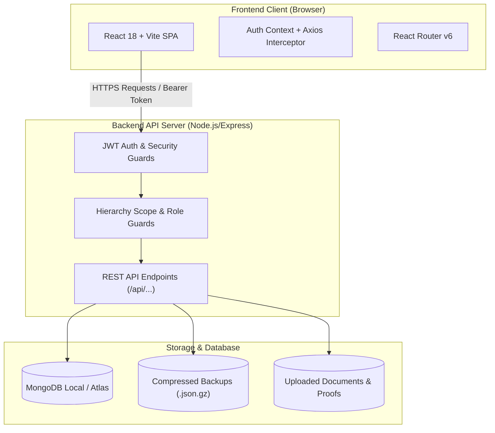
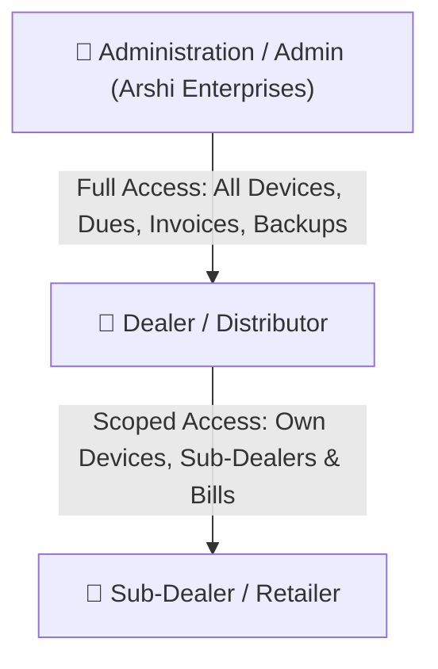

# 📘 CDB Portal V2 (SMT Customer Portal) — Complete Project Guide Book

> **System Name:** CDB Portal / SMT Customer Portal  
> **Client / Organization:** Arshi Enterprises  
> **Application Type:** Device Lifecycle, GPS Fleet Activation, Due Tracking & GST Billing ERP  
> **Production Domain:** [cdbportal.cloud](https://cdbportal.cloud)  
> **Production Server:** Ubuntu 24.04 VPS (`187.127.185.4`)

---

## 📑 Table of Contents
1. [Project Overview & Objectives](#1-project-overview--objectives)
2. [Technology Stack & System Architecture](#2-technology-stack--system-architecture)
3. [User Roles & Hierarchy Scope](#3-user-roles--hierarchy-scope)
4. [Core Modules & Operational Workflows](#4-core-modules--operational-workflows)
   - [4.1 Device Management & Inventory](#41-device-management--inventory)
   - [4.2 Activation Requests (Single & Bulk)](#42-activation-requests-single--bulk)
   - [4.3 Device Renewal System](#43-device-renewal-system)
   - [4.4 Invoicing & Dealer Billing Engine](#44-invoicing--dealer-billing-engine)
   - [4.5 Due Dashboard & Financial Ledger](#45-due-dashboard--financial-ledger)
   - [4.6 User & Sub-Dealer Management](#46-user--sub-dealer-management)
   - [4.7 Database Backups & Disaster Recovery](#47-database-backups--disaster-recovery)
5. [Server Architecture & Production Deployment](#5-server-architecture--production-deployment)
6. [Daily Operations & VPS Cheatsheet](#6-daily-operations--vps-cheatsheet)
7. [Troubleshooting & Maintenance FAQ](#7-troubleshooting--maintenance-faq)

---

## 1. Project Overview & Objectives

**CDB Portal V2** is an enterprise-grade web application built to streamline GPS device distribution, activation workflows, subscription renewals, dealer ledger balances, and GST-compliant tax invoicing.

### Key Business Goals:
- **Centralized Inventory:** Track device IMEIs, ICCIDs, validity periods, and multi-tier dealer allocations.
- **High-Volume Activations:** Support single and bulk activation uploads (up to 1,000 devices per batch) without server timeout.
- **Accurate Financial Accountability:** Real-time tracking of dealer dues, partial payments, payment verifications, and ledger history.
- **Automated Invoicing:** One-click generation of Tax Invoices and Dealer Proforma Bills with automatic CGST+SGST / IGST calculation.
- **High Reliability & Zero Data Loss:** Multi-tier automated snapshots, 1-Time Undo safety checkpoints before restore, and disk backups.

---

## 2. Technology Stack & System Architecture



### Stack Details:
- **Frontend:** React 18, Vite 5, React Icons (`Fa...`), React Router DOM, Axios, Custom CSS & Split layouts.
- **Backend:** Node.js (v20+), Express.js, Mongoose ODM, JSONWebToken (JWT), Multer (file uploads), Gzip/Zlib.
- **Database:** MongoDB (Local `127.0.0.1:27017` on production VPS, MongoDB Atlas cluster for staging).
- **Process Manager:** PM2 (`smt-portal-backend`).
- **Web Server:** Nginx (Reverse proxy with SSL on port 80/443).

---

## 3. User Roles & Hierarchy Scope

The portal enforces a strict 3-tier hierarchical security scope:



| Role | Portal Type | Capabilities |
| :--- | :--- | :--- |
| **Admin** | `Administration` / `partner` | Full access: Manage all users, assign devices, approve activations/renewals, see total portal revenue & dues, trigger backups, clear data. |
| **Dealer** | `Dealer` | View assigned devices, raise activation/renewal requests, create Sub-Dealers, view own ledger & bills, pay dues. |
| **Sub Dealer**| `Sub Dealer` | View devices allocated by their parent Dealer, request activations under parent Dealer. |

---

## 4. Core Modules & Operational Workflows

### 4.1 Device Management & Inventory
- **Location:** `Device Management` / `Add Device`
- **Functions:**
  - Single device registration: Input IMEI, ICCID, Serial No, Model, 1-Year Rate, 2-Year Rate, and Initial Validity.
  - Bulk Device Upload: Upload CSV/Excel containing device inventories.
  - Dynamic Pricing: Stores custom default renewal pricing directly on the device document (`oneYearAmount`, `twoYearAmount`).

### 4.2 Activation Requests (Single & Bulk)
- **Location:** `Service Requests` -> `Activation Requests`
- **Workflow:**
  1. Dealer selects device IMEIs or uploads a bulk Excel list (up to **1,000 devices** supported).
  2. The system validates IMEIs against inventory, checks whether they are already active or assigned.
  3. Admin reviews pending requests:
     - **Approve:** Activates devices, automatically extends device expiry based on plan/inventory tenure, records transactions in Dealer Ledger.
     - **Reject:** Marks request rejected with remarks, device remains available.

### 4.3 Device Renewal System
- **Location:** `Renewal Due Devices` & `Service Requests` -> `Renewal Requests`
- **Features:**
  - Automatically flags devices expiring in ≤ 30 days or already expired.
  - Supports 1-Year and 2-Year extensions.
  - **Manual Renewal Amount Override:** Admin/Dealer can adjust the renewal fee per device or batch.

### 4.4 Invoicing & Dealer Billing Engine
- **Location:** `Invoice Generator`
- **Bill Types:**
  - **Tax Invoice:** GST compliant, generates serial invoice number (e.g. `INV-2026-XXXX`).
  - **Dealer Proforma Bill:** Pre-billing summary for dealers without affecting tax filings.
- **Tax Intelligence:**
  - If Dealer State == Admin State (`Bihar`): 9% CGST + 9% SGST.
  - If Dealer State != Admin State: 18% IGST.
  - Includes A4 printable format with Bank Details, QR Code, and authorized signatory.

### 4.5 Due Dashboard & Financial Ledger
- **Location:** `Due Dashboard` & `Ledger Book`
- **Calculation Formula:**
  $$\text{Total Dues} = \sum (\text{Active Device Bills} + \text{Invoiced Amounts}) - \sum (\text{Approved Payments})$$
- **Payment Verification Workflow:**
  1. Dealer makes bank transfer / UPI and submits payment proof (UTR / Transaction ID + Screenshot).
  2. Appears in **Payment Verification Requests** for Admin review.
  3. Upon Admin approval, dealer dues decrease and ledger is updated instantly.

### 4.6 User & Sub-Dealer Management
- **Location:** `User Management`
- **Features:**
  - Create new Admin, Dealer, or Sub-Dealer accounts.
  - State, GSTIN, PAN, and full address capture for automatic bill generation.
  - **Status Toggle:** Instantly toggle user between `Active` and `Inactive`.
  - **Permanent Deletion:** Allows Admin to safely delete duplicate or obsolete accounts while safeguarding parent devices and preserving at least one main Admin account.

### 4.7 Database Backups & Disaster Recovery
- **Location:** `User Management` -> `Automated Backups Repository`
- **Capabilities:**
  - **Instant Snapshot:** Creates a `.json.gz` full database dump on disk.
  - **Download:** Download any backup snapshot directly to your computer.
  - **1-Click Restore with 1-Time Safety Undo:** Before restoring an old backup, the system automatically captures a pre-restore checkpoint. If a restore was done by mistake, click **"1-Time Undo"** to instantly revert.
  - **Delete Backup:** Permanently remove old snapshot files from disk to free up VPS storage.
  - **Clean Operational Data Script:** Run `backend/clear_portal_data.js` to wipe test data (devices, bills, dues) while safely preserving all login accounts.

---

## 5. Server Architecture & Production Deployment

```
/var/www/smt-portal/
├── backend/
│   ├── config/             # DB connection & environment
│   ├── middleware/         # Auth, hierarchy scoping, rate limiters
│   ├── models/             # Mongoose schemas (User, Device, Invoice, etc.)
│   ├── routes/             # Express API controllers
│   ├── storage/backups/    # Gzipped database snapshots (.json.gz)
│   ├── uploads/            # Payment screenshots & documents
│   ├── server.js           # Main backend entry point
│   ├── clear_portal_data.js# Operational reset utility
│   └── .env                # Production secrets & DB connection string
├── frontend/
│   ├── src/                # React source code & components
│   ├── dist/               # Built static bundle served by Nginx
│   └── package.json
└── docker-compose.yml       # Containerized configuration
```

---

## 6. Daily Operations & VPS Cheatsheet

### Connect to VPS:
```bash
ssh root@187.127.185.4
cd /var/www/smt-portal
```

### Deploy Latest Changes from GitHub:
```bash
# 1. Pull latest code
git pull origin main

# 2. Build frontend
cd frontend && npm run build

# 3. Restart backend service
cd ../backend && pm2 restart all
```

### Check PM2 Status & Logs:
```bash
pm2 status
pm2 logs smt-portal-backend --lines 50
```

### Reset Operational Data (Clean Test Data Safely):
```bash
cd /var/www/smt-portal/backend
node clear_portal_data.js "mongodb://127.0.0.1:27017/smt_portal"
```

---

## 7. Troubleshooting & Maintenance FAQ

### Q1: Devices count or Dues mismatch on Dealer dashboard?
- **Cause:** Device `dealerId` might be stored as a String instead of ObjectId or vice versa.
- **Fix:** The backend now automatically matches both formats (`{ $in: [dealerId, String(dealerId)] }`). Refresh the page or check the Due Dashboard.

### Q2: Activation request bulk upload fails with large file?
- **Cause:** Bulk limits previously restricted to 100 rows.
- **Fix:** The limit is now **1,000 devices per batch**. Ensure column headers include `IMEI` and `ICCID`.

### Q3: Admin cannot delete duplicate accounts or see action buttons?
- **Cause:** Restricted userType checks.
- **Fix:** Fixed in latest commit. Admins can delete any non-self Admin or Dealer account directly from User Management.

### Q4: Nginx shows 502 Bad Gateway?
- **Check Backend:** Run `pm2 status`. If status is `errored`, run `pm2 logs` to inspect MongoDB connectivity.
- **Check MongoDB:** Run `systemctl status mongod` and ensure local MongoDB is active.

---
*Guide Book Version: 2.4.0 — Maintained for Arshi Enterprises CDB Portal.*
